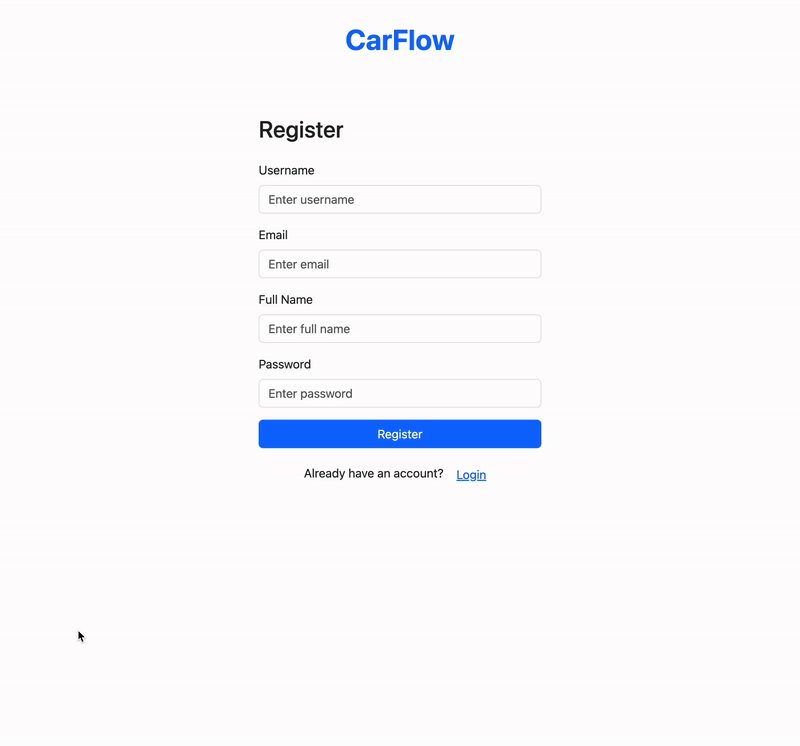

# Car Rental Service Web Application 🚗

A full-stack car rental management system built with **Spring Boot**, **MSSQL**, and **Thymeleaf**, supporting three roles: Customer, Employee, and Admin.

---

## 🔧 Features

### 👤 Customer

* Register and log in
* Browse and reserve available vehicles
* View and cancel reservations
* Update profile and view rental history

### 👨‍🔧 Employee

* Add and modify vehicle listings
* Approve or reject rental requests
* Manage maintenance schedules
* Create coupon codes

### 🛠️ Admin

* Create, update, and delete user accounts (customers & employees)
* Modify or delete vehicle listings
* Promote users to employee role

---

## 🧰 Tech Stack

* **Backend:** Spring Boot, Spring MVC, Spring Security, JPA (Hibernate)
* **Frontend:** Thymeleaf, HTML/CSS, JavaScript
* **Database:** MSSQL
* **Project Management:** GitHub Feature Branches, Scrum + Kanban
* **Version Control:** Git & GitHub

---

## 🌐 Live Demo

Experience the application live at: [Car Rental Service](https://car-rental-service-47xj.onrender.com)

> **Note:** The server may take up to ~60 seconds to spin up if it's in a cold state.

### 🔑 Default Credentials

* **Customer:** Username: `Customer`, Password: `customer`
* **Employee:** Username: `Employee`, Password: `employee`
* **Admin:** Username: `Admin`, Password: `admin`

---

## 📷 Screenshots

### Login + Registration Page


### Admin Dashboard (Includes all user views/features)


> **Note:** UI design inspired by [Figma Community Design – Modern UI Kit](https://www.figma.com/community/file/1138316365849534403)

---

## 🚀 Getting Started

### Prerequisites

* Java 17+
* MSSQL Server
* Maven (used for dependency management and builds)
* Spring Boot CLI or IntelliJ IDEA

### Steps

1. Clone the repository
   `git clone https://github.com/raghavSharma8269/CarRentalService_DbFinalProject.git`
2. Create a new database in MySQL.
3. Update your `application.properties` with DB credentials.
4. Run the project via IntelliJ or command line using:

   ```
   ./mvnw spring-boot:run
   ```
5. Navigate to `http://localhost:8080`.